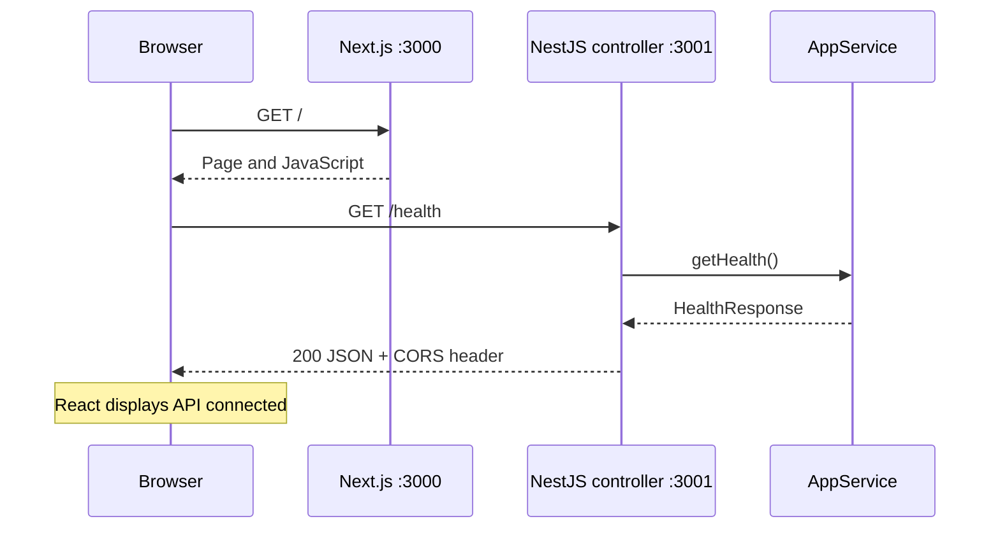

# Phase 1 architecture

## Current system

This repository contains two independent npm applications plus a root command runner. It is not configured as an npm workspaces project. Each package has its own lockfile.

The health request originates in the browser's client component. Next.js does not proxy it. The page checks HTTP success plus the expected status and service identity. A failed request, invalid response, or five-second timeout results in API unavailable.

## Responsibilities

| File | Responsibility |
| --- | --- |
| package.json | concurrently starts both app scripts; verify runs checks sequentially |
| apps/web/src/app/layout.tsx | Shared HTML layout and metadata |
| apps/web/src/app/page.tsx | Client component, request, connection state and page rendering |
| apps/web/src/app/globals.css | Responsive page styles |
| apps/api/src/main.ts | Load optional environment file, configure CORS, start listener |
| apps/api/src/app.module.ts | Register controller and service with Nest |
| apps/api/src/app.controller.ts | Map HTTP routes and delegate to service |
| apps/api/src/app.service.ts | Construct the typed health response |
| apps/api/test/app.e2e-spec.ts | Exercise actual HTTP routes on a test app |

Nest dependency injection constructs AppService and supplies it to AppController. The controller need not create its own service. Separating these responsibilities becomes more useful as business logic grows.

## Health contract

GET /health returns HTTP 200 and a JSON object with status (the literal ok), service (automation-monitor-api), and timestamp (a UTC ISO date string generated at request time). No authentication is required for this local endpoint. GET / retains the generated Hello World response for compatibility.

HealthResponse is a TypeScript compile-time interface, not runtime validation. No incoming automation data is accepted yet. This endpoint proves API availability, not database readiness, queue health, or the success of an automation.

## Configuration

| Setting | Default | Read by |
| --- | --- | --- |
| PORT | 3001 | NestJS on startup |
| FRONTEND_URL | http://localhost:3000 | NestJS CORS configuration |
| NEXT_PUBLIC_API_URL | http://localhost:3001 | Next.js client bundle |

The API listens on 127.0.0.1. Ports 3000 and 3001 make the apps different browser origins. CORS allows a browser page at the configured frontend origin to read the response; it does not authenticate callers or stop non-browser requests. A plain Supertest HTTP test does not prove browser CORS behavior, because it neither boots main.ts nor enforces browser policy.

NEXT_PUBLIC values are visible to users and are embedded at build time for production. Never store secrets there. Restart development processes after environment changes. Do not commit real environment files.

## Why these choices

- Separate backend: makes API boundaries and backend responsibilities explicit for learning.
- TypeScript: catches code-level type mistakes; runtime input validation comes later.
- Small health endpoint: verifies one complete request path before adding storage.
- No database yet: keeps Phase 1 focused; persistence is Phase 2.
- Retain Vitest and Oxlint from the installed Nest generator: avoid adding competing tools.
