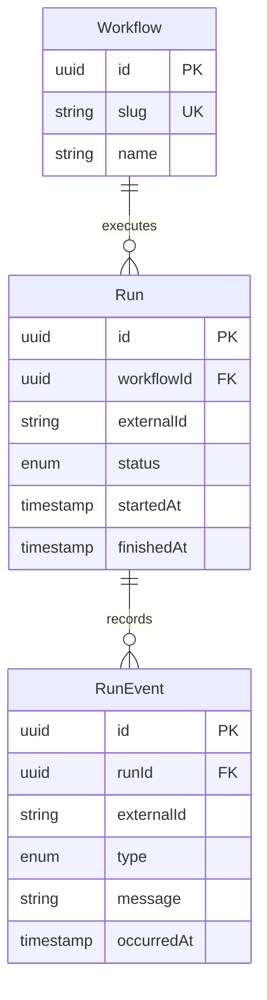

# Phase 2: Database and data modeling

## Goal and scope

Persist a workflow, its execution and its events in PostgreSQL; read them through NestJS and prove that restarting services preserves them. These are local synthetic records. No real n8n integration, event ingestion, authentication, dashboard database UI, or workspace isolation is implemented yet.

## Tools

- PostgreSQL 17 in Docker Compose: relational storage.
- Prisma 7: schema, migrations and generated TypeScript client.
- @prisma/adapter-pg and pg: connect the Prisma client to PostgreSQL.
- NestJS: read-only development routes and dependency injection.
- Vitest/Supertest: HTTP boundary tests. tsx: execute TypeScript seed/check scripts.

Prisma 7 keeps the CLI connection URL in prisma.config.ts and uses a driver adapter at runtime. Generation and seeding are explicit commands. Production deployment is outside this phase.

## Model



One workflow has many runs; one run has many events. UUID primary keys identify rows. Foreign keys require the parent to exist. Restrict deletion preserves historical children. Each external run ID is unique within its workflow; each external event ID is unique within its run. Indexes support queries by workflow/time, status/time and run/time. State transitions and validating incoming event timestamps belong to Phase 4.

## Local setup

Start Docker Desktop and wait for its Linux engine. From E:\automation-monitor:

```powershell
npm run setup:env
npm run db:up
npm run db:generate
npm run db:deploy
npm run db:seed
npm run dev
```

For a fresh clone, install dependencies first as described in README. setup:env generates matching local credentials without printing them; it preserves existing configuration. Compose reads root .env, while Prisma/NestJS read apps/api/.env. Real environment files are ignored by Git; examples contain no real credentials. Changing a password in a file does not change an already initialized database's password.

The database listens only on 127.0.0.1:5433. Container port 5432 is mapped to host port 5433 to avoid a common local conflict. Data is bind-mounted at E:\automation-monitor\.data\postgres, which Git ignores. Docker's own engine and images may live elsewhere according to Docker Desktop settings. Stop/restart preserves the bind-mounted data; deleting that directory destroys it. A persistent directory is not a backup.

scripts/docker.mjs finds Docker on PATH or its known Windows installation locations. It can use the installed Compose plugin directly without changing your global PATH. Set DOCKER_BIN for a different installation.

## Read the code

1. compose.yaml: database service, port, storage and health check.
2. apps/api/prisma/schema.prisma: models, enums and constraints.
3. apps/api/prisma/migrations: versioned SQL creating the tables and indexes.
4. apps/api/prisma.config.ts: CLI configuration.
5. apps/api/src/database/prisma.service.ts: one lazily created client per Nest provider; disconnect on shutdown.
6. apps/api/src/workflows: guard, controller and service that query the database.
7. apps/api/prisma/seed.ts: transaction with upserts, safe to run repeatedly without duplicating demo records.

The checked-in migration was generated by diffing an empty schema against our Prisma schema. db:deploy applies it and records it in Prisma's migration history. For later schema edits, db:migrate -- --name descriptive_name creates a new migration. Do not reset a database to resolve a migration issue without reviewing the data impact.

## API and boundaries

- GET /health remains a lightweight API liveness check; it does not query PostgreSQL.
- GET /dev/workflows returns at most 50 workflows with run counts.
- GET /dev/workflows/:id/runs returns at most 50 recent runs with up to 100 earliest events per run.
- Malformed UUIDs return 400; absent workflows return 404; unavailable database returns a generic 503 without exposing connection details.
- Both development routes return 404 unless ENABLE_DEV_ROUTES=true, and always return 404 when NODE_ENV=production.

There is no write endpoint. The limits are an intentional temporary bound, not full pagination. Proper authenticated endpoints and pagination come later. Restart the backend after setting local environment variables.

## Verify

```powershell
npm run verify
npm run db:seed
npm run db:seed
npm run db:check
npm run db:restart
npm run db:up
npm run db:check
```

The two db:check outputs should have the same workflow and run IDs. The check asserts sample counts, duplicate rejection, foreign-key rejection, and transaction rollback. It uses real PostgreSQL. The automated HTTP tests use a mocked query service to isolate opt-in/production boundaries and UUID validation; these alone do not prove database persistence.

Read /dev/workflows and its returned workflow's runs route, restart the backend, and read again. Do not start a duplicate API on the same port. Record actual executed checks separately from this checklist.

## Manager questions

1. Why separate workflows from runs? One definition executes many times, and each execution has its own status and history.
2. Why events as another table? One execution can have multiple timestamped changes without overwriting its history.
3. What is a migration? Versioned SQL that evolves database structure reproducibly.
4. Why use upsert in the seed? Repeated demo setup should not create duplicate records.
5. What does a transaction do? Commits related changes together or rolls them back together.
6. Why does restart preserve data? PostgreSQL writes into the persistent host directory, outside the container's disposable layer.
7. Does an ORM replace SQL knowledge? No; constraints, queries, indexes and transactions still operate in PostgreSQL.
8. Is the system ready for customer data? No; Phase 3 adds authentication and workspace isolation.

## Exercise

Locate the composite unique constraint for Run. Explain why two different workflows may use the same externalId, but two runs of the same workflow may not. Then show a manager the migration SQL enforcing that rule.

Review changes and obtain owner confirmation before committing or pushing.

## Recorded verification

See [executed checks](PHASE-02-VERIFICATION.md). Run npm run db:check:http after a backend build to exercise real database reads through NestJS and compare records across API restarts.
